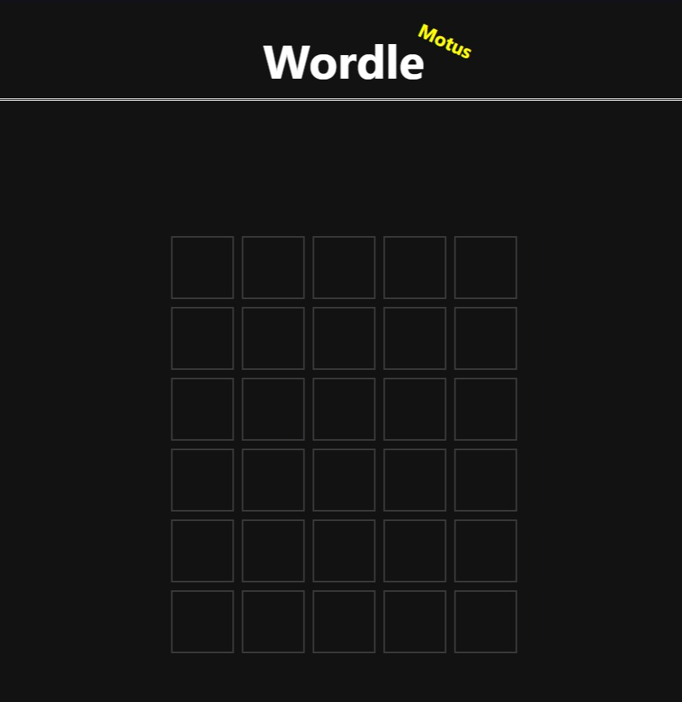

# Clone Wordle

## Objectif

Ce projet a été donné aux étudiants durant leur formation à Simplon.co Outre-Mer. C'est un projet solo d'une durée de deux semaines.

L'objectif était de réaliser une page web dynamique s'inspirant d'un jeu nommé Wordle.

## Description du jeu

Wordle est un jeu de lettres en ligne gratuit développé en 2021 par Josh Wardle. 

Le but du jeu est de deviner un mot spécifique de cinq lettres en un maximum de six tentatives, en tapant des lettres sur un écran de six lignes de cinq cases chacune.La personne qui joue inscrit sur la première ligne un mot de cinq lettres de son choix et entre sa proposition. Après chaque proposition, les lettres apparaissent en couleurs : le fond gris représente les lettres qui ne se trouvent pas dans le mot recherché, le fond jaune représente les lettres qui se trouvent ailleurs dans le mot, et le fond vert représente les lettres qui se trouvent à la bonne place dans le mot à trouver. Un seul mot est proposé par jour. Il est possible de copier dans le presse-papier la grille jouée (positions des lettres bien placées et mal placées) afin de la partager.

## Objectifs atteints

Durant ce projet j'ai pu :

- Création d'une page HTML
- Conception de l'interface (ergonomie, responsive, utilisabilité)
- Implémentation de la gestion de l'input d'un clavier
- Création de l'algorithme (gestion des réponses)

